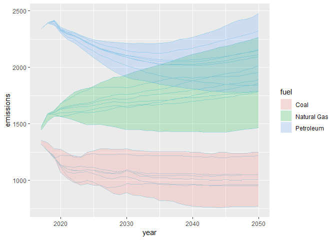

<!-- README.md is generated from README.Rmd. Please edit that file -->

# jplots

<!-- badges: start -->

<!-- badges: end -->

The goal of jplots is to provide some customized plot functions.

## Installation

You can install the development version of jplots from
[GitHub](https://github.com/) with:

``` r
# install.packages("devtools")
devtools::install_github("jameelalsalam/jplots")
```

## Example

The function `geom_area_bar` constructs variable-width bars. Unlike the
`width` parameter to `geom_bar`, this treats the x axis as a numeric
scale. For this reason there is no gap between the area\_bars (as the
gap would create offset on x-axis scale).

``` r
suppressPackageStartupMessages(library(ggplot2))
library(jplots)

ggplot(ei_ex,
       aes(x = vos,
           y = ei,
           fill = naics)) +
  geom_area_bar(color = "black")
```


There are also custom functions to create an “envelope” around a set of
lines, as a way to summarize multiple series.

This version uses the `envelope_fig` function which constructs the
entire plot:

``` r

envelope_fig(aeo_ex, xname = year, yname = emissions, 
             groupname = scenario, 
             facetname = fuel)
```


However, this approach is not as flexible as using the official ggplot2
extension approach. The following approach extends `geom_ribbon` with a
new function `geom_envelope` that calculates the minimum/maximum value
of `y` at each value of `x` and draws an envelope around that range.

``` r

ggplot(aeo_ex,
       mapping = aes(x = year,
                     y = emissions)) +
  facet_grid(. ~ fuel) +
  geom_line(aes(group = scenario), 
            color = "light blue") +
  geom_envelope(aes(fill = fuel))
```


This approach allows re-mixing the geometry in different ways, e.g.,
without the facetting:

``` r
ggplot(aeo_ex,
       mapping = aes(x = year,
                     y = emissions)) +
  geom_line(aes(group = interaction(fuel, scenario)), 
                color = "light blue") +
  geom_envelope(aes(fill = fuel, group = fuel))
```



One important detail: the line geom and the envelope geom have different
groupings, so the group aesthetic will have to be specified in one or
both geoms. The `interaction` function is useful to group by the
interaction of two variables on the fly.
