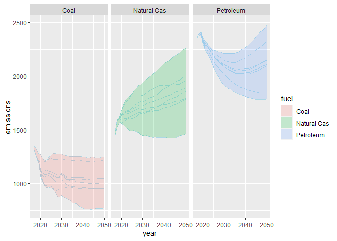

<!-- README.md is generated from README.Rmd. Please edit that file -->

# jplots

<!-- badges: start -->

<!-- badges: end -->

The goal of jplots is to provide some custom plot functions.

## Installation

You can install the development version of jplots from
[GitHub](https://github.com/) with:

``` r
# install.packages("devtools")
devtools::install_github("jameelalsalam/jplots")
```

## Example

This is a basic example which shows you how to solve a common problem:

``` r
suppressPackageStartupMessages(library(ggplot2))
library(jplots)

ggplot(ei_ex,
       aes(x = vos,
           y = ei,
           fill = naics)) +
  geom_area_bar(color = "black")
```


``` r

envelope_fig(aeo_ex, xname = year, yname = emissions, 
             groupname = scenario, 
             facetname = fuel)
```


``` r

ggplot(aeo_ex,
       mapping = aes(x = year,
                     y = emissions)) +
  facet_grid(. ~ fuel) +
  geom_line(aes(group = scenario), color = "light blue")
```


